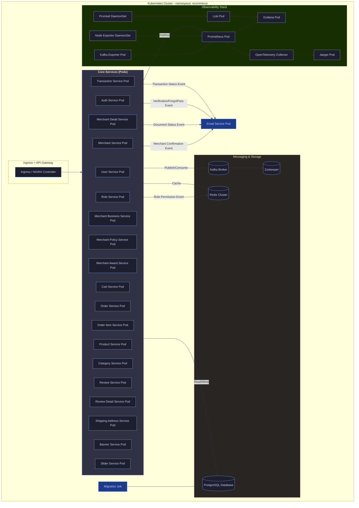
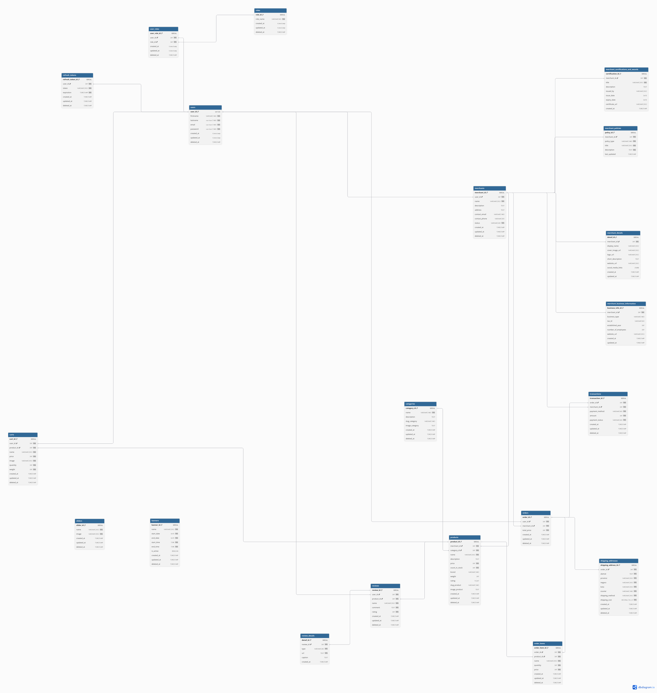
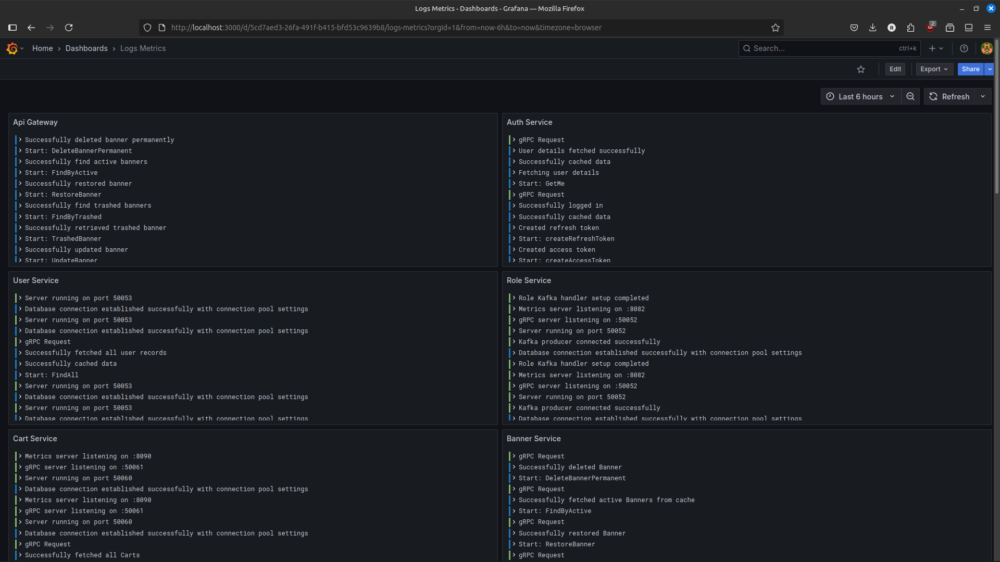
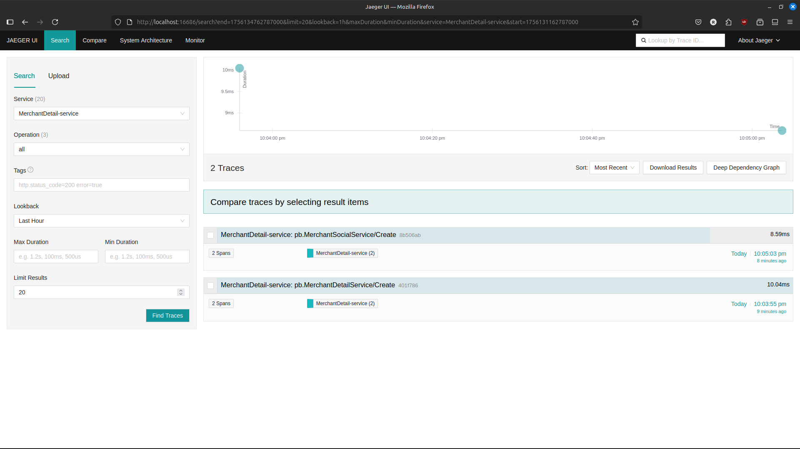
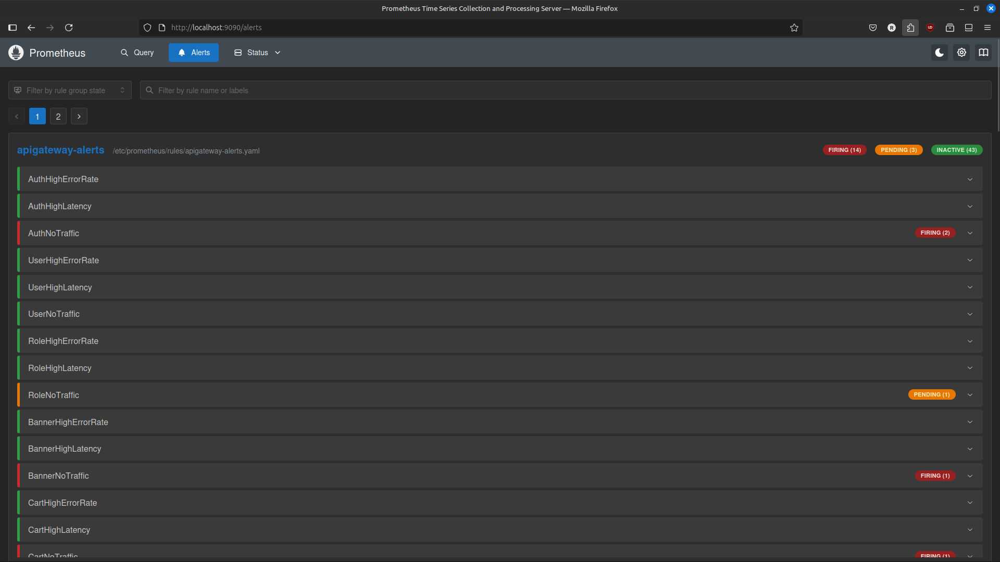
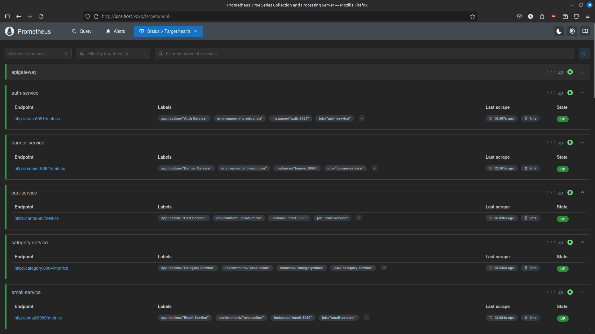
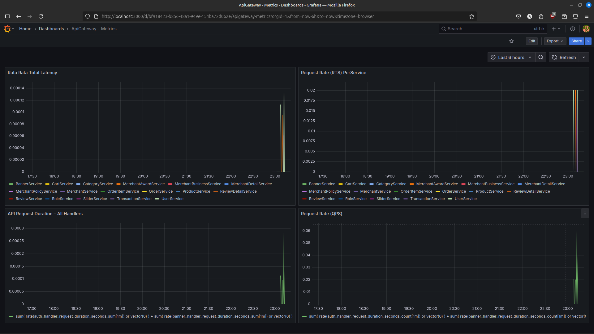
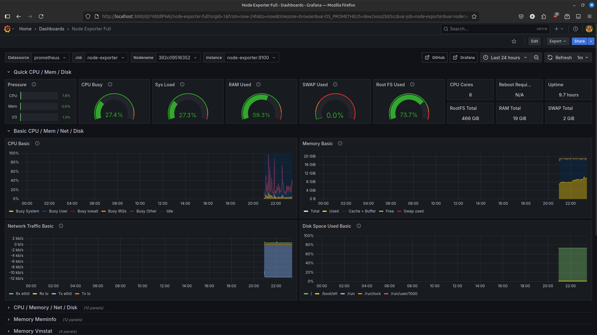

# ✨ Distributed Modular Monolith Ecommerce

Proyek ini adalah **implementasi backend untuk platform e-commerce**, yang dirancang menggunakan **Arsitektur Monolit Modular**. Arsitektur ini mengikuti model penerapan monolitik tetapi dengan pemisahan kepentingan yang jelas antara berbagai **domain bisnis** seperti Pengguna, Pedagang, Produk, Pesanan, Transaksi, dan Ulasan.

Dengan mengadopsi pendekatan monolit modular, sistem tetap **terstruktur, dapat dipelihara, dan konsisten**, sambil juga membuka pintu untuk **evolusi potensial menuju layanan mikro** di masa depan jika skalabilitas yang lebih tinggi diperlukan.

Komunikasi antar modul di dalam monolit ditangani secara internal melalui **panggilan fungsi langsung/batas domain**, sementara interaksi eksternal (seperti antara API Gateway dan server utama atau dengan cache/broker pesan) ditangani menggunakan **gRPC** dan **REST API**. Persistensi data dikelola melalui **PostgreSQL** sebagai basis data utama, dengan **Redis** untuk caching dan **Kafka** sebagai broker pesan berbasis peristiwa.

Selain fungsionalitas bisnis, proyek ini dilengkapi dengan **tumpukan observabilitas modern** (Prometheus, Loki, Grafana, Jaeger, OpenTelemetry), yang memungkinkan visibilitas penuh ke dalam metrik, log, dan jejak terdistribusi. Ini memastikan debugging yang lebih baik, pemantauan kinerja, dan keandalan operasional.

---

### 🎯 Fitur Utama

* **🔐 Otentikasi & Manajemen Pengguna**
  Mendukung pendaftaran pengguna, login, token penyegaran, dan otorisasi berbasis peran menggunakan **JWT**.

* **🏬 Manajemen Pedagang**
  Pedagang dapat membuat dan mengelola toko mereka, termasuk detail bisnis, kebijakan, dokumen verifikasi, dan penghargaan.

* **📦 Manajemen Produk & Inventaris**
  CRUD penuh untuk produk dan kategori, termasuk pelacakan stok, penetapan harga, deskripsi, dan kategorisasi produk.

* **🛒 Keranjang Belanja & Manajemen Pesanan**
  Pelanggan dapat menambahkan item ke keranjang mereka, melanjutkan ke checkout, dan menghasilkan pesanan resmi. Pesanan ditautkan dengan produk, item, dan pedagang.

* **💳 Pemrosesan Transaksi & Pembayaran**
  Sistem mencatat transaksi, menangani status pembayaran, dan dapat memicu acara konfirmasi untuk layanan lain (misalnya, pemberitahuan email).

* **⭐ Ulasan Produk**
  Pelanggan dapat mengirimkan ulasan dan peringkat setelah menyelesaikan pembelian, meningkatkan interaktivitas dan kepercayaan platform.

* **📧 Integrasi Eksternal**
  Acara seperti konfirmasi pedagang, verifikasi akun, dan pembaruan transaksi dapat memicu **Layanan Email** untuk pemberitahuan.

* **📊 Observabilitas Penuh**

  * **Metrik**: Prometheus + Grafana
  * **Logging**: Loki + Promtail
  * **Tracing**: Jaeger + OpenTelemetry Collector
  * **Eksportir**: Node Exporter, Kafka Exporter

* **🐳 Opsi Penerapan (Docker & Kubernetes)**

  * **Docker Compose**: Menyediakan lingkungan pengembangan lokal yang lengkap dengan mengatur layanan, basis data, dan alat observabilitas.
  * **Kubernetes (K8s)**: Menyediakan penerapan yang siap produksi, dapat diskalakan, dan tangguh dengan Pod terpisah per layanan, **Horizontal Pod Autoscalers (HPA)** untuk penskalaan, dan observabilitas terintegrasi.

---

### 🏗️ Lingkungan & Penerapan

* **Lingkungan Docker**
  Diatur melalui `docker-compose`, termasuk API Gateway (NGINX), layanan inti, Redis, PostgreSQL, Kafka, Layanan Email, dan tumpukan observabilitas. Ideal untuk penyiapan pengembangan lokal yang cepat dan konsisten.

* **Lingkungan Kubernetes**
  Diterapkan di bawah namespace khusus (`ecommerce`). Setiap layanan berjalan di Pod-nya sendiri dengan penskalaan otomatis opsional menggunakan **HPA**. Infrastruktur inti mencakup Kafka (dengan Zookeeper), Redis Cluster, dan PostgreSQL. Komponen observabilitas berjalan sebagai Pod/DaemonSet, memastikan log, metrik, dan jejak dikumpulkan dan divisualisasikan.


## 🛠️ Teknologi yang Digunakan
- 🚀 **gRPC** — Menyediakan API berkinerja tinggi dan bertipe kuat.
- 📡 **Kafka** — Digunakan untuk mempublikasikan acara terkait saldo (misalnya, setelah pembuatan kartu).
- 📈 **Prometheus** — Mengumpulkan metrik seperti jumlah permintaan dan latensi untuk setiap metode RPC.
- 🛰️ **OpenTelemetry (OTel)** — Memungkinkan pelacakan terdistribusi untuk observabilitas.
- 🦫 **Go (Golang)** — Bahasa implementasi.
- 🌐 **Echo** — Kerangka kerja HTTP untuk Go.
- 🪵 **Zap Logger** — Pencatatan terstruktur untuk debugging dan operasi.
- 📦 **Sqlc** — Generator kode SQL untuk Go.
- 🧳 **Goose** — Alat migrasi basis data.
- 🐳 **Docker** — Alat kontainerisasi.
- 🧱 **Docker Compose** — Menyederhanakan kontainerisasi untuk lingkungan pengembangan dan produksi.
- 🐘 **PostgreSQL** — Basis data relasional untuk menyimpan data pengguna.
- 📃 **Swago** — Generator dokumentasi API.
- 🧭 **Zookeeper** — Manajemen konfigurasi terdistribusi.
- 🔀 **Nginx** — Proksi terbalik untuk lalu lintas HTTP.
- 🔍 **Jaeger** — Pelacakan terdistribusi untuk observabilitas.
- 📊 **Grafana** — Alat pemantauan dan visualisasi.
- 🧪 **Postman** — Klien API untuk menguji dan men-debug titik akhir.
- ☸️ **Kubernetes** — Platform orkestrasi kontainer untuk penerapan, penskalaan, dan manajemen.
- 🧰 **Redis** — Penyimpanan nilai kunci dalam memori yang digunakan untuk caching dan akses data cepat.
- 📥 **Loki** — Sistem agregasi log untuk mengumpulkan dan menanyakan log.
- 📤 **Promtail** — Agen pengiriman log yang mengirim log ke Loki.
- 🔧 **OTel Collector** — Kolektor agnostik vendor untuk menerima, memproses, dan mengekspor data telemetri (metrik, jejak, log).
- 🖥️ **Node Exporter** — Mengekspos metrik tingkat sistem (host) seperti CPU, memori, disk, dan statistik jaringan untuk Prometheus.

## Memulai

Ikuti petunjuk ini untuk menjalankan proyek di mesin lokal Anda untuk tujuan pengembangan dan pengujian.

### Prasyarat

Pastikan Anda telah menginstal alat-alat berikut:
-   [Git](https://git-scm.com/)
-   [Go](https://go.dev/) (versi 1.20+)
-   [Docker](https://www.docker.com/)
-   [Docker Compose](https://docs.docker.com/compose/)
-   [Make](https://www.gnu.org/software/make/)

### 1. Klon Repositori

```sh
git clone https://github.com/your-username/monolith-ecommerce-grpc.git
cd monolith-ecommerce-grpc
```

### 2. Konfigurasi Lingkungan

Proyek ini menggunakan file lingkungan untuk konfigurasi. Anda perlu membuat file `.env` yang diperlukan.
*   Buat file `.env` di direktori root untuk pengaturan umum.
*   Buat file `docker.env` di `deployments/local/` untuk pengaturan khusus Docker.

Anda dapat menyalin file contoh jika ada, atau membuatnya dari awal.

### 3. Jalankan Aplikasi

Perintah berikut akan membangun image Docker, memulai semua layanan, dan menyiapkan basis data.

**1. Bangun image dan luncurkan layanan:**
Perintah ini membangun semua image layanan dan memulai seluruh infrastruktur (termasuk basis data, Kafka, dll.) menggunakan Docker Compose.

```sh
make build-up
```

**2. Jalankan Migrasi Basis Data:**
Setelah kontainer berjalan, terapkan migrasi skema basis data.

```sh
make migrate
```

**3. Isi Basis Data (Opsional):**
Untuk mengisi basis data dengan data awal untuk pengujian, jalankan seeder.

```sh
make seeder
```

Platform sekarang harus beroperasi penuh. Anda dapat memeriksa status kontainer yang berjalan dengan `make ps`.

### Menghentikan Aplikasi

Untuk menghentikan dan menghapus semua kontainer yang berjalan, gunakan perintah berikut:

```sh
make down
```

## Gambaran Arsitektur

Platform ini dirancang menggunakan arsitektur **Monolit Modular Terdistribusi**. Gaya canggih ini memberikan keseimbangan unik, menawarkan pengembangan yang disederhanakan dan pengujian yang disederhanakan dari monolit sambil memungkinkan penskalaan dan penerapan independen dari sistem berbasis layanan mikro.

Aplikasi ini dibangun sebagai biner Go tunggal yang berisi semua modul logika bisnis. Saat runtime, beberapa instance biner ini diterapkan, dengan setiap instance dikonfigurasi untuk menjalankan modul tertentu (misalnya, `auth`, `product`, `order`), yang secara efektif berperilaku seperti layanan terpisah.

Sistem ini dirancang untuk diterapkan menggunakan kontainerisasi, dengan kontainer terpisah untuk setiap layanan. Ini memungkinkan penskalaan dan manajemen komponen secara independen di lingkungan seperti produksi.

### Konsep Arsitektur Utama:

*   **API Gateway**: Titik masuk tunggal untuk semua permintaan klien. Ini merutekan lalu lintas ke layanan backend yang sesuai, menangani otentikasi, dan menyediakan API terpadu.
*   **gRPC untuk Komunikasi Antar-Layanan**: gRPC berkinerja tinggi digunakan untuk komunikasi antara layanan internal, memastikan latensi rendah dan kontrak bertipe kuat.
*   **Pesan Asinkron dengan Kafka**: Kafka digunakan untuk komunikasi berbasis peristiwa, memisahkan layanan dan meningkatkan ketahanan. Misalnya, ketika kartu baru dibuat, sebuah pesan dipublikasikan ke topik Kafka, yang kemudian dikonsumsi oleh layanan `email` untuk memperbarui saldo.
*   **Observabilitas Terpusat**: Platform ini mengintegrasikan tumpukan observabilitas yang komprehensif:
    *   **Prometheus** untuk mengumpulkan metrik.
    *   **Jaeger** (melalui OpenTelemetry) untuk pelacakan terdistribusi.
    *   **Loki** dan **Promtail** untuk agregasi log.
    *   **Grafana** untuk visualisasi metrik, jejak, dan log.

### Arsitektur Penerapan

#### Lingkungan Docker
Pengaturan Docker menggunakan `docker-compose` untuk mengatur semua layanan, basis data, dan alat yang diperlukan untuk lingkungan pengembangan lokal yang lengkap.

```mermaid
flowchart TD
    %% ======================
    %% API Gateway
    %% ======================
    subgraph Gateway
        NGINX
    end

    %% ======================
    %% Core Services (Grouped)
    %% ======================
    subgraph CoreServices[Core Services]
        subgraph UserDomain
            US[User Service]
            AS[Auth Service]
            RlS[Role Service]
        end

        subgraph MerchantDomain
            MS[Merchant Service]
            MDS[Merchant Detail Service]
            MBS[Merchant Business Service]
            MPS[Merchant Policy Service]
            MAS[Merchant Award Service]
        end

        subgraph OrderDomain
            CS[Cart Service]
            OS[Order Service]
            OIS[Order Item Service]
            PS[Product Service]
            CatS[Category Service]
        end

        subgraph ReviewDomain
            RS[Review Service]
            RDS[Review Detail Service]
        end

        SAS[Shipping Address Service]
        BS[Banner Service]
        SS[Slider Service]
        TS[Transaction Service]
    end

    %% ======================
    %% Observability
    %% ======================
    subgraph ObservabilityStack[Observability Stack]
        Promtail
        KafkaExporter
        NodeExporter
        Prometheus
        Loki
        OtelCollector
        Grafana
        Jaeger
    end

    %% ======================
    %% External Systems
    %% ======================
    EmailS[Email Service]
    Redis[(Redis Cache)]

    %% ======================
    %% Gateway -> Core Services
    %% ======================
    NGINX --> CoreServices

    %% ======================
    %% Core Services -> Prometheus (metrics)
    %% ======================
    CoreServices -->|/metrics| Prometheus

    %% ======================
    %% Observability Connections
    %% ======================
    Promtail --> Loki
    KafkaExporter --> Prometheus
    NodeExporter --> Prometheus
    Prometheus --> OtelCollector
    Prometheus --> Grafana
    Loki --> Grafana
    OtelCollector --> Jaeger

    %% ======================
    %% Events -> Email Service
    %% ======================
    MS -->|Merchant Confirmation Event| EmailS
    MDS -->|Document Status Event| EmailS
    AS -->|Verification/ForgotPass Event| EmailS
    TS -->|Transaction Confirmation Event| EmailS

    %% ======================
    %% Role Permission Event -> Redis
    %% ======================
    RlS -->|Role Permission Event| Redis

    %% ======================
    %% Core Services <-> Redis (Cache)
    %% ======================
    CoreServices --- Redis

    classDef default fill:#1e1e2e,stroke:#89b4fa,color:#cdd6f4,stroke-width:1px;
    classDef gateway fill:#1e293b,stroke:#94e2d5,color:#f0fdfa,font-weight:bold;
    classDef core fill:#313244,stroke:#cba6f7,color:#f5e0dc,font-weight:bold;
    classDef obs fill:#1a2e05,stroke:#a6e3a1,color:#d9f99d;
    classDef misc fill:#1e3a8a,stroke:#89b4fa,color:#bfdbfe;

    class Gateway gateway;
    class CoreServices core;
    class ObservabilityStack obs;
    class EmailS,Redis external;

```



#### Lingkungan Kubernetes
Pengaturan Kubernetes menyediakan penerapan yang dapat diskalakan dan tangguh. Setiap layanan berjalan dalam set Pod-nya sendiri, dengan Horizontal Pod Autoscalers (HPA) untuk penskalaan otomatis berdasarkan beban.




### Komponen Inti

*   **API Gateway**: Titik masuk tunggal untuk semua lalu lintas HTTP yang masuk dari klien. Ini bertanggung jawab untuk validasi permintaan, otentikasi, dan perutean permintaan ke modul layanan hilir yang sesuai melalui gRPC.

*   **Modul Layanan**: Logika bisnis inti dienkapsulasi dalam modul-modul yang berbeda (misalnya, `User`, `Product`, `Cart`, `Order`). Meskipun dikemas dalam satu biner, mereka berjalan sebagai proses terpisah di lingkungan terdistribusi, memastikan isolasi kesalahan dan skalabilitas independen.

*   **Komunikasi**:
    *   **Sinkron (gRPC)**: Komunikasi berkinerja tinggi dan latensi rendah antara API Gateway dan layanan internal dicapai menggunakan gRPC.
    *   **Asinkron (Kafka)**: Untuk memisahkan layanan dan menangani alur kerja berbasis peristiwa, platform menggunakan Kafka. Misalnya, ketika pesanan ditempatkan, acara `order_created` dapat dipublikasikan, yang dapat dilanggani oleh layanan lain tanpa membuat ketergantungan langsung.

### Data dan Caching

*   **Basis Data (PostgreSQL)**: Basis data PostgreSQL pusat menyimpan data inti untuk aplikasi. Setiap modul layanan bertanggung jawab atas skemanya sendiri di dalam basis data ini.
*   **Caching (Redis)**: Redis digunakan sebagai cache dalam memori untuk menyimpan data yang sering diakses, mengurangi beban basis data dan meningkatkan waktu respons.

### Observabilitas

Platform ini memiliki tumpukan observabilitas tingkat produksi yang komprehensif yang dibangun di atas tiga pilar observabilitas:

*   **Logging (Loki & Promtail)**: Semua layanan menghasilkan log terstruktur. Promtail mengumpulkan log-log ini dan meneruskannya ke Loki, sistem agregasi log pusat, yang memungkinkan kueri dan analisis yang kuat.
*   **Metrik (Prometheus & Grafana)**: Setiap layanan mengekspos metrik terperinci (misalnya, tingkat permintaan, kesalahan, latensi). Prometheus mengikis dan menyimpan metrik-metrik ini, sementara Grafana menyediakan dasbor interaktif yang kaya untuk visualisasi dan pemantauan.
*   **Tracing (Jaeger & OpenTelemetry)**: Untuk memahami alur permintaan di berbagai layanan, sistem diinstrumentasi dengan OpenTelemetry untuk pelacakan terdistribusi. Jejak dikirim ke Jaeger, memungkinkan pengembang untuk memvisualisasikan grafik panggilan, mengidentifikasi hambatan kinerja, dan men-debug masalah di lingkungan terdistribusi.


## Makefile

Proyek ini dilengkapi dengan `Makefile` yang berisi berbagai perintah untuk memfasilitasi pengembangan. Berikut adalah beberapa perintah yang tersedia:

- `make migrate`: Jalankan migrasi basis data
- `make migrate-down`: Batalkan migrasi basis data
- `make generate-proto`: Hasilkan kode Go dari file `.proto`
- `make generate-sql`: Hasilkan kode Go dari file SQL
- `make generate-swagger`: Hasilkan dokumentasi Swagger
- `make seeder`: Isi basis data dengan data awal
- `make build-image`: Bangun image Docker untuk semua layanan
- `make image-load`: Muat image Docker ke Minikube
- `make image-delete`: Hapus image Docker dari Minikube
- `make ps`: Tampilkan status kontainer Docker
- `make up`: Jalankan semua layanan dengan Docker Compose
- `make down`: Hentikan semua layanan yang berjalan dengan Docker Compose
- `make build-up`: Bangun image dan jalankan semua layanan dengan Docker Compose
- `make kube-start`: Mulai Minikube
- `make kube-up`: Jalankan semua layanan di Kubernetes
- `make kube-down`: Hentikan semua layanan di Kubernetes
- `make kube-status`: Tampilkan status pod, layanan, PVC, dan pekerjaan di Kubernetes
- `make kube-tunnel`: Buat terowongan ke Minikube
- `make test-auth`: Jalankan tes pada layanan `auth`


### ScreenShoot

### Sql



### Loki



### Jaeger



### Prometheus 

#### Peringatan







### Grafana Prometheus




### Node Exporter

